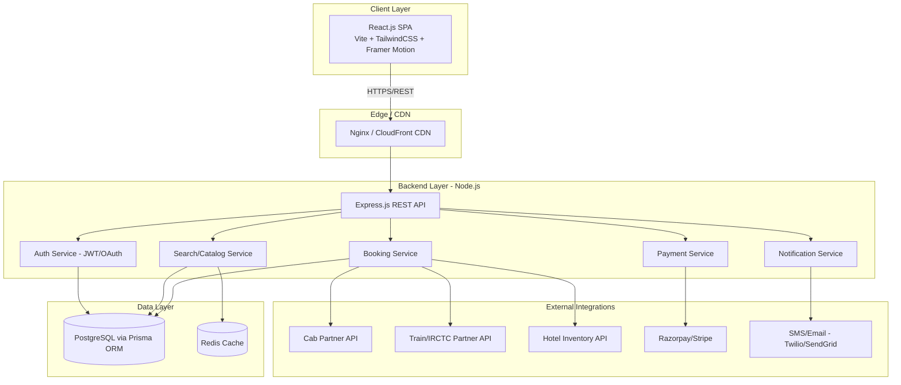
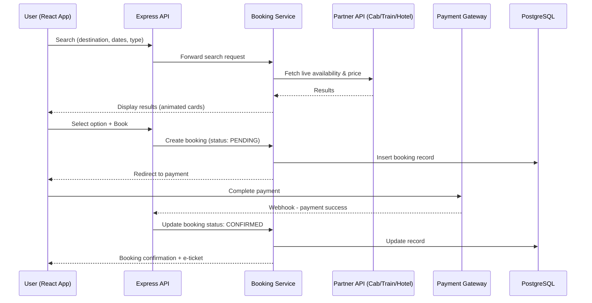
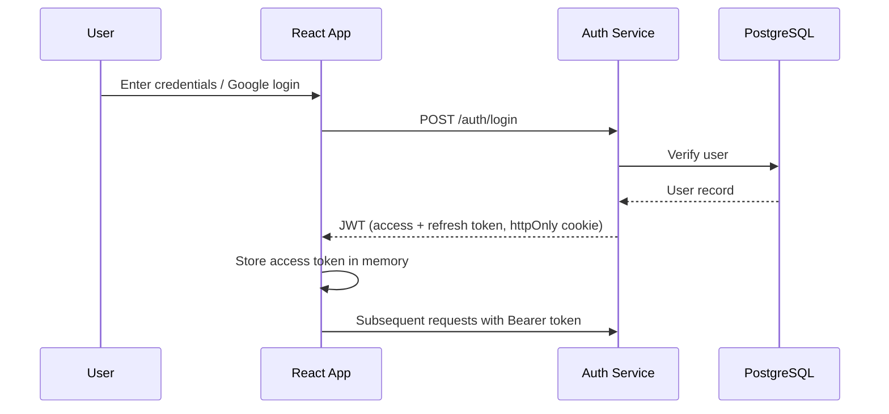

# TravelGo — Travel & Tourism Platform
### Product & Engineering Documentation
**Version 1.0 | Prepared by: Senior Software Architecture Team | Date: September 2026**

---

## 1. Product Requirements Document (PRD)

### 1.1 Product Vision
TravelGo is a full-service travel and tourism platform that lets users discover popular destinations, compare prices, and book **cabs, trains, and hotels** through a single, unified, beautifully animated web experience — modeled around India's most-loved destinations (Goa, Manali, Jaipur, Kerala, and more).

### 1.2 Problem Statement
Travelers today juggle 4–5 different apps to plan one trip — one for hotels, one for cabs, one for trains, one for destination research. TravelGo consolidates discovery + booking into one seamless journey, reducing planning time and decision fatigue.

### 1.3 Target Users
| Persona | Description | Primary Need |
|---|---|---|
| Leisure Traveler | Plans 2-3 domestic trips/year | Inspiration + easy end-to-end booking |
| Business Traveler | Frequent short trips | Fast cab + train booking, saved preferences |
| Family Planner | Books for 4-6 people | Price comparison, bundled deals, reliable hotels |
| Budget Backpacker | Price-sensitive, flexible dates | Lowest fare alerts, filters |

### 1.4 Core Features (MVP Scope)

**A. Homepage**
- Hero section with search bar (Destination / Dates / Guests)
- Popular Places grid — image, short description, starting price, rating
- "Book Cabs / Trains / Hotels" quick-access tiles
- Login / Sign up (email + OTP, Google OAuth)
- About Us, testimonials, footer with support links
- Scroll-triggered animations, parallax hero, hover-interactive cards

**B. Destination Discovery**
- Browse by category (Hill Stations, Beaches, Heritage, Wildlife)
- Destination detail page: description, gallery, weather, best time to visit, price range, nearby attractions

**C. Cab Booking**
- Search by pickup/drop location + date/time
- Choose vehicle type (Hatchback / Sedan / SUV)
- Fare estimate, driver assignment, live tracking (post-MVP)
- Booking confirmation + e-receipt

**D. Train Booking**
- Search by source/destination station + travel date
- Class selection (Sleeper / AC 3-tier / AC 2-tier / AC 1st)
- Seat availability display, passenger details form
- PNR generation + booking confirmation (integration with IRCTC-like partner API)

**E. Hotel Booking**
- Search by city/destination + check-in/out dates + rooms/guests
- Filter by price, star rating, amenities
- Room selection, guest details, booking confirmation
- Cancellation/refund policy display

**F. User Account**
- Profile management, saved trips, booking history
- Wishlist/saved destinations
- Payment methods management

**G. Payments**
- Razorpay/Stripe integration — cards, UPI, net banking, wallets
- Invoice generation (PDF)

### 1.5 Non-Functional Requirements
| Category | Requirement |
|---|---|
| Performance | Homepage first paint < 2s; API p95 latency < 300ms |
| Scalability | Support 50K concurrent users at launch, horizontally scalable |
| Availability | 99.9% uptime SLA |
| Accessibility | WCAG 2.1 AA compliant |
| Responsiveness | Mobile-first, works on 320px–2560px viewports |
| SEO | Server-side rendering/SSG for destination & landing pages |

### 1.6 Success Metrics
- Conversion rate: search → booking ≥ 8%
- Avg. session duration ≥ 4 minutes
- Cart/booking abandonment < 25%
- App Store/Web Vitals score ≥ 90

### 1.7 Out of Scope (Phase 1)
- Flight booking
- Multi-currency/international payments
- Native mobile apps (React Native — Phase 2)

---

## 2. Technical Architecture

### 2.1 High-Level Architecture



### 2.2 Frontend Architecture (React.js)

```
src/
├── components/
│   ├── common/         # Button, Card, Modal, SearchBar
│   ├── layout/          # Navbar, Footer, Hero
│   └── animations/       # Framer Motion wrappers
├── pages/
│   ├── Home/
│   ├── Destinations/
│   ├── CabBooking/
│   ├── TrainBooking/
│   ├── HotelBooking/
│   ├── Auth/            # Login, Signup, OTP
│   └── Profile/
├── features/            # Redux Toolkit slices (auth, booking, search)
├── services/            # Axios API clients
├── hooks/               # Custom hooks (useAuth, useDebounce, useBooking)
├── routes/              # React Router v6 config
├── utils/
└── App.jsx
```

**Key Patterns:** Component-driven design, code-splitting via `React.lazy`, React Query (TanStack Query) for server-state caching, Redux Toolkit for global UI/auth state, React Hook Form + Zod for form validation.

### 2.3 Backend Architecture (Node.js + Express)

```
server/
├── src/
│   ├── modules/
│   │   ├── auth/          # controller, service, routes, validators
│   │   ├── cab/
│   │   ├── train/
│   │   ├── hotel/
│   │   ├── destination/
│   │   ├── booking/
│   │   └── payment/
│   ├── middlewares/       # auth guard, error handler, rate limiter
│   ├── config/            # env, prisma client, redis client
│   ├── jobs/               # cron: fare refresh, booking reminders
│   └── app.js
├── prisma/
│   ├── schema.prisma
│   └── migrations/
└── server.js
```

**Pattern:** Layered architecture (Route → Controller → Service → Repository/Prisma) with modular monolith design — easily splittable into microservices later (Auth, Booking, Payment as independent services).

### 2.4 Database Schema (PostgreSQL + Prisma) — Core Models

```prisma
model User {
  id            String   @id @default(uuid())
  name          String
  email         String   @unique
  phone         String?  @unique
  passwordHash  String?
  authProvider  String   @default("local") // local, google
  role          Role     @default(USER)
  bookings      Booking[]
  wishlist      Wishlist[]
  createdAt     DateTime @default(now())
}

model Destination {
  id          String   @id @default(uuid())
  name        String
  category    String   // hill-station, beach, heritage, wildlife
  description String
  images      String[]
  startPrice  Decimal
  rating      Float    @default(0)
  bestTimeToVisit String?
}

model Booking {
  id          String   @id @default(uuid())
  userId      String
  type        BookingType // CAB, TRAIN, HOTEL
  status      BookingStatus @default(PENDING)
  details     Json        // type-specific payload
  amount      Decimal
  payment     Payment?
  createdAt   DateTime @default(now())
  user        User @relation(fields: [userId], references: [id])
}

model Payment {
  id          String   @id @default(uuid())
  bookingId   String   @unique
  provider    String   // razorpay, stripe
  status      PaymentStatus
  transactionId String
  booking     Booking @relation(fields: [bookingId], references: [id])
}

enum Role { USER ADMIN DRIVER_PARTNER }
enum BookingType { CAB TRAIN HOTEL }
enum BookingStatus { PENDING CONFIRMED CANCELLED COMPLETED }
enum PaymentStatus { INITIATED SUCCESS FAILED REFUNDED }
```

### 2.5 API Design (REST, sample endpoints)
| Method | Endpoint | Description |
|---|---|---|
| POST | `/api/auth/signup` | Register user |
| POST | `/api/auth/login` | Login, returns JWT |
| GET | `/api/destinations?category=` | List popular places |
| GET | `/api/destinations/:id` | Destination detail |
| POST | `/api/cabs/search` | Search cab availability & fare |
| POST | `/api/trains/search` | Search train availability |
| POST | `/api/hotels/search` | Search hotels |
| POST | `/api/bookings` | Create booking (any type) |
| GET | `/api/bookings/:id` | Booking status |
| POST | `/api/payments/create-order` | Initiate payment |
| POST | `/api/payments/webhook` | Payment gateway webhook |

---

## 3. System Workflow

### 3.1 Booking Flow (Generic — Cab/Train/Hotel)



### 3.2 Authentication Flow


### 3.3 Search-to-Book User Journey
1. User lands on homepage → animated hero + search bar
2. Enters destination/dates → autocomplete suggestions (debounced API call)
3. Browses Popular Places (filter by category/price)
4. Clicks a service tile (Cab/Train/Hotel) → dedicated search form
5. Views results (skeleton loaders → animated result cards)
6. Selects option → review & passenger/guest details
7. Payment → confirmation with e-ticket/invoice
8. Booking appears in "My Trips" dashboard

---

## 4. Security Architecture

### 4.1 Authentication & Authorization
- **JWT-based auth**: short-lived access token (15 min) + httpOnly, secure, sameSite refresh token (7 days)
- **OAuth 2.0** for Google login
- **RBAC** (Role-Based Access Control): USER, ADMIN, DRIVER_PARTNER roles enforced via middleware
- Password hashing with **bcrypt** (cost factor 12); OTP-based login as alternative

### 4.2 API & Application Security
| Layer | Control |
|---|---|
| Input validation | Zod/Joi schema validation on every endpoint |
| SQL Injection | Prevented by Prisma's parameterized queries |
| XSS | React's default escaping + CSP headers |
| CSRF | SameSite cookies + CSRF tokens for state-changing requests |
| Rate limiting | `express-rate-limit` + Redis (per-IP & per-user) |
| Security headers | `helmet.js` (HSTS, X-Frame-Options, CSP) |
| CORS | Whitelisted origins only |
| Secrets management | Environment variables via AWS Secrets Manager / Vault (never in code) |

### 4.3 Data Security
- TLS 1.3 for all traffic (enforced HTTPS)
- Encryption at rest for PostgreSQL (AES-256)
- PII (phone, email) access-logged and masked in application logs
- Payment data **never stored** — tokenized via Razorpay/Stripe (PCI-DSS compliant delegation)

### 4.4 Infrastructure Security
- Web Application Firewall (WAF) in front of API (AWS WAF/Cloudflare)
- Database in private subnet, accessible only from backend service via VPC
- Automated dependency vulnerability scanning (Dependabot/Snyk)
- Regular penetration testing + OWASP Top 10 checklist review each release

### 4.5 Monitoring & Incident Response
- Centralized logging (ELK/CloudWatch) with audit trails for bookings & payments
- Real-time alerting on anomalous login patterns (Sentry + custom rules)
- Automated backups (daily, point-in-time recovery enabled)

---

## 5. Technology Stack

### 5.1 Frontend
| Tool | Purpose |
|---|---|
| React.js (Vite) | Core UI framework |
| TailwindCSS | Styling/design system |
| Framer Motion | Page transitions, scroll reveals, micro-interactions |
| GSAP (optional) | Complex hero/parallax animations |
| Redux Toolkit | Global state (auth, cart) |
| TanStack Query | Server-state caching, data fetching |
| React Hook Form + Zod | Forms & validation |
| React Router v6 | Routing |
| Axios | HTTP client |

### 5.2 Backend
| Tool | Purpose |
|---|---|
| Node.js + Express.js | REST API server |
| Prisma ORM | Type-safe DB access + migrations |
| PostgreSQL | Primary relational database |
| Redis | Caching, session store, rate-limit counters |
| JWT (jsonwebtoken) | Auth tokens |
| bcrypt | Password hashing |
| Zod/Joi | Request validation |
| Bull/BullMQ | Background jobs (emails, reminders) |

### 5.3 DevOps & Infrastructure
| Tool | Purpose |
|---|---|
| Docker + Docker Compose | Containerization |
| GitHub Actions | CI/CD pipeline |
| AWS (EC2/ECS, RDS, S3, CloudFront) or Vercel + Railway | Hosting |
| Nginx | Reverse proxy/load balancing |
| Sentry | Error monitoring |
| Grafana + Prometheus | Metrics/observability |

### 5.4 Third-Party Integrations
- **Payments:** Razorpay (India-first) / Stripe
- **SMS/Email:** Twilio, SendGrid
- **Maps:** Google Maps API (cab pickup/drop, destination location)
- **Cab/Train/Hotel inventory:** Partner aggregator APIs (or mock services for MVP)

---

## 6. Animation & Visual Design Strategy

To make the homepage feel premium and alive, the following animation patterns are recommended (implemented via **Framer Motion** primarily, GSAP for hero-level complexity):

| Element | Animation |
|---|---|
| Hero section | Parallax background image + fade/slide-up headline & search bar on load |
| Search bar | Micro-interaction on focus (glow/scale), animated destination autocomplete dropdown |
| Popular Places cards | Scroll-triggered fade+slide-in (staggered), hover lift with shadow & image zoom |
| Category tabs (Cab/Train/Hotel) | Animated underline/indicator sliding between active tabs |
| Page transitions | Smooth fade/slide between routes via `AnimatePresence` |
| Loading states | Skeleton shimmer loaders instead of spinners |
| Booking confirmation | Success checkmark micro-animation (Lottie) |
| Testimonials | Auto-scrolling marquee/carousel |
| Numbers/stats (e.g., "10,000+ happy travelers") | Count-up animation on scroll into view |

**Design principle:** Animations should be purposeful (guide attention, confirm actions) and performant — keep to `transform`/`opacity` properties, respect `prefers-reduced-motion`, and cap durations at 200–500ms for UI feedback.

---

## 7. Suggested Roadmap
| Phase | Scope | Est. Duration |
|---|---|---|
| Phase 1 (MVP) | Homepage, auth, destination browsing, hotel + cab booking, payments | 8–10 weeks |
| Phase 2 | Train booking integration, wishlist, reviews/ratings | 4–5 weeks |
| Phase 3 | Admin dashboard, driver-partner app, React Native app | 6–8 weeks |
| Phase 4 | AI trip planner, dynamic pricing, multi-language support | Ongoing |

---

### Next Steps
Happy to proceed with any of the following:
1. Build the animated **React homepage demo** (with the "TravelGo" branding, Indian destinations, search bar, login modal)
2. Scaffold the **Node.js + Express + Prisma backend** starter code
3. Design the **Figma-style wireframes** for key screens

Just let me know which one to start with.
